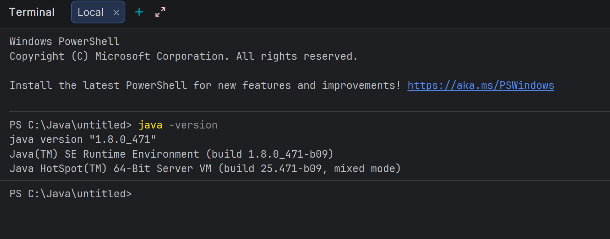

# Setup_Instructions.md

## JDK Version Used

For this project, I used: **JDK Version: 1.8.0_471**



# Brief Explanation: “Hello World” Program Run

1. **Write Code:**
    - Create a file with this code:
      ```java
      public class HelloWorld {
         public static void main(String[] args) {
            System.out.println("Hello World");
         }
      }
      ```

2. **Compile:**
    - Run `javac HelloWorld.java` to convert source to bytecode (`HelloWorld.class`).

3. **Run:**
    - Execute `java HelloWorld` to launch the program.

4. **Output:**
    - The console displays:
      ```
      Hello World
      ```